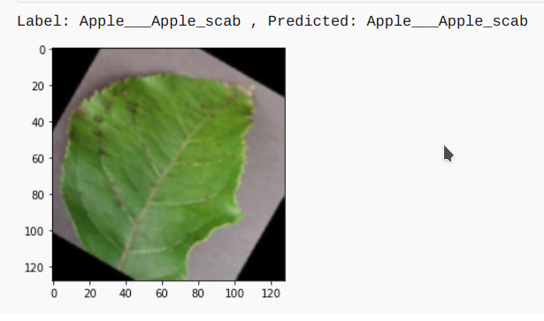
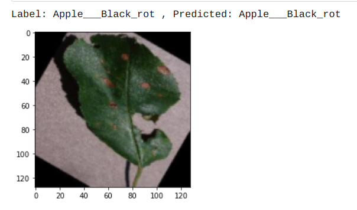
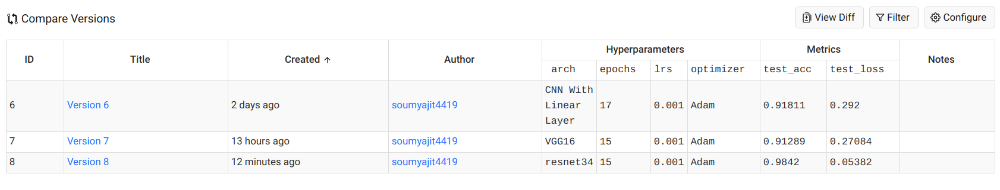

## PLANT-AI [Recognition of Plant Diseases by Leaf Image Classification]
----------
 
----------

## Description
   Food security for billions of people on earth requires minimizing crop damage by timely detection of diseases.Developing methods
for detection  of plant diseases serves the dual purpose of increasing crop yield and reducing pesticide use without knowing 
about the proper disease. Along with development of better crop varieties, disease detection is thus paramount goal for achieving 
food security. The traditional method of disease detection has been to use manual examination by either farmers or experts, which 
can be time consuming and costly, proving infeasible for millions of small and medium sized farms around the world.

   This project is an approach to the development of plant disease recognition model, based on leaf image classification, by the
use of deep convolutional networks. The developed model is able to recognize 38 different types of plant diseases out of of 14 different plants with the ability to distinguish plant leaves from their surroundings.

## Leaf Image Classification

 This process for building a model which can detect the disease assocaited with the leaf image. The key points to be followed are:

1. Data gathering 

   The dataset taken was **"New Plant Diseases Dataset"**. It can be downloaded through the link " https://www.kaggle.com/vipoooool/new-plant-diseases-dataset". It is an Image dataset containing images of different healthy and unhealthy crop leaves.

2. Model building
   - I have used pytorch for building the model.
   - I used three models:-
      1. The CNN model architecture consists of CNN Layer, Max Pooling, Flatten a Linear Layers.
      2. Using Transfer learning VGG16 Architecture.
      3. Using Transfer learning resnet34 Architecture.

3. Training

   The model was trained  by  using variants of above layers mentioned in model building and by varying hyperparameters. The best model was able to achieve 98.42% of test accuracy.

4. Testing

   The model was tested on total 17572 images of 38 classes. 
   The model used for prediction on sample images. It can be seen below:
   <!--  -->
   

   
   
   

5. Various Model Architecture tried along with Learning Rate and Optimizer and various accuracy obtained with different models.
 
  

  All the version with code can be seen in `jovian.ml` (https://jovian.ml/soumyajit4419/course-project-plant-disease-classification) 
 
  
## Details about the model

### The model will be able to detect `38` types of `diseases` of `14 Unique plants`
- The detail list of plants and diseases can be seen in  [List](Src) 

## Usage:

### Code For Model Building and Training  
   Refer to the notebook [Code](Src)  

### All the trained models
   Trained weights at [Models](Models)

## Further Work:
- Implementing Image Localisation to find the excat position of the leaf affected .
- Building Recommender system for recommendation of proper presticides and  control method for the disease. 
- Implementing the appropriate management strategies like fungicide applications and pesticide applications could lead to early 
information on crop health and disease detection.This could facilitate the control of diseases and improve productivity.

## License
This project is Licensed under `MIT` 

## Explanation
`To understand the code :` You  can find the complete explanation to the code in [Article](https://medium.com/@soumyajit4419/plant-ai-c8fc95ed90e6?source=friends_link&sk=4707825cbaefa2dcaaa92d0e3ed5de01)