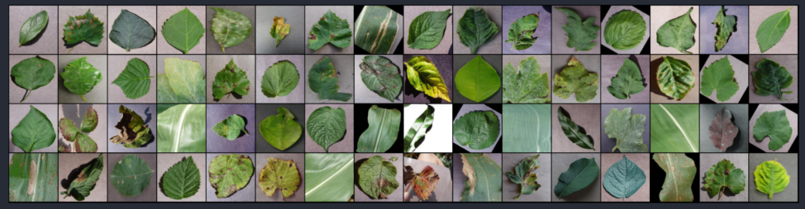

## PLANT-AI [Recognition of Plant Diseases by Leaf Image Classification]
----------
 
----------

## Description
   Food security for billions of people on earth requires minimizing crop damage by timely detection of diseases.Developing methods
for detection  of plant diseases serves the dual purpose of increasing crop yield and reducing pesticide use without knowing 
about the proper disease. Along with development of better crop varieties, disease detection is thus paramount goal for achieving 
food security. The traditional method of disease detection has been to use manual examination by either farmers or experts, which 
can be time consuming and costly, proving infeasible for millions of small and medium sized farms around the world.

   This project is an approach to the development of plant disease recognition model, based on leaf image classification, by the
use of deep convolutional networks. The developed model is able to recognize 38 different types of plant diseases out of healthy leaves,of 14 different plants with the ability to distinguish plant leaves from their surroundings.

## Leaf Image Classification

Humans are used to non verbal communication. The emotions expressed increases the clarity of any thoughts and ideas. It becoms quite interesting when a computer can capture this complex feature of humans, ie emotions. This topic talks about building a model which can detect an emotion from an image. There key points to be followed are:

1. Data gathering and  augmentation

   The dataset taken was **"fer2013"**. It can be downloaded through the link "https://github.com/npinto/fer2013". Image augmentation was performed on this data.

2. Model building

   The model architecture consists of CNN Layer, Max Pooling, Flatten and Dropout Layers.

3. Training

   The model was trained  by  using variants of above layers mentioned in model building and by varying hyperparameters. The best model was able to achieve 60.1% of validation accuracy.

4. Testing

   The model was tested with sample images. It can be seen below:

   
   
   

#### The model will be able to detect 7 types of emotions:-
#####  Angry , Sad ,  Neutral ,  Disgust ,  Surprise ,  Fear  , and   Happy

## Usage:

### Dataset
The dataset has been taken from kaggle  
Link to dataset:- https://www.kaggle.com/vipoooool/new-plant-diseases-dataset

### For  Face Detection, and Emotion Detection Code

Refer to the notebook /Emotion_Detection.ipynb. 
I have trained an emotion detection model and put its trained weights at /Models

### Train your Emotion Detection Model
To train your own emotion detection model, Refer to the notebook /facial_emotion_recognition.ipynb

### For Emotion Detection  using Webcam 
#### Clone the repo:
Run `pip install -r requirements.txt`  
` python Emotion_Detection.py`

## Further Work:
Implementing the appropriate management strategies like fungicide applications, disease-specific chemical applications, and  pesticide applications could lead to early information on crop health and disease detection.This could facilitate
the control of diseases and improve productivity.